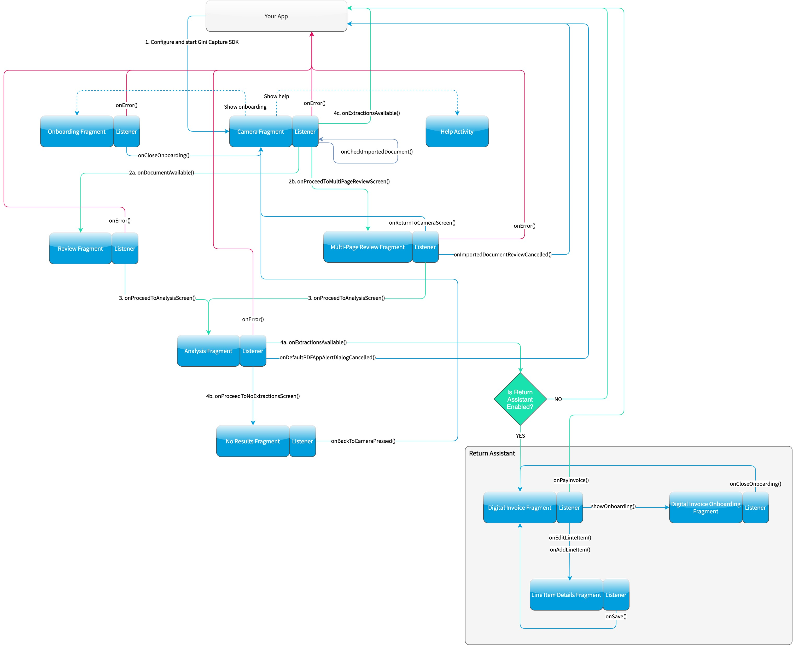

Invoice Capture Features
========================

Features from the Gini Capture SDK
----------------------------------

The capture feature uses our `Gini Capture SDK <https://github.com/gini/gini-capture-sdk-android/>`_. All features
listed in its `documentation <https://developer.gini.net/gini-capture-sdk-android/html/features.html>`_ can be used here
as well.

An important difference is in how you configure the capture features. In the Gini Pay Bank SDK you need to use the
``CaptureConfiguration`` instead of the Gini Capture SDK's ``GiniCapture.Builder``. The configuration names are the same
so you can easily map them to the ``CaptureConfiguration``.

File Import (Open With)
~~~~~~~~~~~~~~~~~~~~~~~

Another difference is related to the `file import
<https://developer.gini.net/gini-capture-sdk-android/html/features.html#file-import-open-with>`_ (or "open with")
feature which allows importing of files from other apps via Android's "open with" or "share" functionality.

Screen API
^^^^^^^^^^

To handle imported files using the Gini Pay Bank SDK you need to register an activity result handler with the
``CaptureFlowImportContract()`` and then pass the incoming intent to
``GiniPayBank.GiniPayBank.startCaptureFlowForIntent()``:

.. code-block:: java

    // Use the androidx's Activity Result API to register a handler for the capture result.
    val captureImportLauncher = registerForActivityResult(CaptureFlowImportContract()) { result: CaptureResult ->
        when (result) {
            is CaptureResult.Success -> {
                handleExtractions(result.specificExtractions)
            }
            is CaptureResult.Error -> {
                when (result.value) {
                    is ResultError.Capture -> {
                        val captureError: GiniCaptureError = (result.value as ResultError.Capture).giniCaptureError
                        handleCaptureError(captureError)
                    }
                    is ResultError.FileImport -> {
                        val fileImportError = result.value as ResultError.FileImport
                        handleFileImportError(fileImportError)
                    }
                }
            }
            CaptureResult.Empty -> {
                handleNoExtractions()
            }
            CaptureResult.Cancel -> {
                handleCancellation()
            }
        }
    }

    fun handleFileImportError(exception: ImportedFileValidationException) {
        var message = ...
        exception.validationError?.let { validationError ->
            // Get the default message
            message = getString(validationError.textResource)
            // Or use custom messages
            message = when (validationError) {
                FileImportValidator.Error.TYPE_NOT_SUPPORTED -> ...
                FileImportValidator.Error.SIZE_TOO_LARGE -> ...
                FileImportValidator.Error.TOO_MANY_PDF_PAGES -> ...
                FileImportValidator.Error.PASSWORD_PROTECTED_PDF -> ...
                FileImportValidator.Error.TOO_MANY_DOCUMENT_PAGES -> ...
            }
        }
        AlertDialog.Builder(this)
            .setMessage(message)
            .setPositiveButton("OK") { _, _ -> finish() }
            .show()
    }

    fun startGiniPayBankSDKForImportedFile(importedFileIntent: Intent) {
        // Configure capture first
        configureCapture();

        fileImportCancellationToken = 
            GiniPayBank.startCaptureFlowForIntent(captureImportLauncher, this, importedFileIntent)
    }

Component API
^^^^^^^^^^^^^

When using the Component API you need to create a ``Document`` from the intent using
``GiniPayBank.createDocumentForImportedFiles()`` and then continue either to the ``ReviewFragmentCompat``,
``MultiPageReviewFragment`` or ``AnalysisFragmentCompat``:

.. code-block:: java

    fun startGiniPayBankSDKForImportedFile(importedFileIntent: Intent) {
        GiniPayBank.createDocumentForImportedFiles(importedFileIntent, this, object : AsyncCallback<Document, ImportedFileValidationException> {
            override fun onSuccess(result: Document) {
                if (result.isReviewable) {
                    // If you have enabled capturing documents with multiple pages:
                    launchMultiPageReviewScreen()
                    // OR if you didn't:
                    launchSinglePageReviewScreen()
                } else {
                    launchAnalysisScreen(result)
                }
                finish()
            }

            override fun onError(exception: ImportedFileValidationException) {
                handleFileImportError(exception)
            }

            override fun onCancelled() {
                // Handle cancellation.
            }
        })
    }

Return Assistant
----------------

The return assistant feature allows your users to view and edit payable items in an invoice. The total amount is
updated to be the sum of only those items which the user opts to pay.

To enable this feature simply set ``returnAssistantEnabled`` to ``true`` in the ``CaptureConfiguration``: 

.. code-block:: java

    CaptureConfiguration(returnAssistantEnabled = true)

Screen API
~~~~~~~~~~~

When integrating using the Screen API it is enough to enable the return assistant feature. The Gini Pay Bank SDK will
show the return assistant automatically if the invoice contained payable items and will update the extractions returned
to your app according to the user's changes.

The ``amountToPay`` extraction is updated to be the sum of items the user decided to pay. It includes discounts and
additional charges that might be present on the invoice.

The extractions related to the return assistant are stored in the ``compoundExtractions`` field of the
``CaptureResult``. See the Gini Pay API's `documentation
<https://pay-api.gini.net/documentation/#return-assistant-extractions>`_ to learn about the return assistant's compound
extractions.

Component API
~~~~~~~~~~~~~

Using the Component API is more challenging. You need to manage three additional fragments: ``DigitalInvoiceFragment``,
``DigitalInvoiceOnboardingFragment`` and ``LineItemDetailsFragment``.

.. note::

   See the Component API example app's `digitalinvoice package
   <https://github.com/gini/gini-pay-bank-sdk-android/tree/main/appcomponentapi/src/main/java/net/gini/pay/appcomponentapi/digitalinvoice>`_
   for a sample integration.

The following diagram extends the one found in the Gini Capture SDK's `Component API guide
<https://developer.gini.net/gini-capture-sdk-android/html/integration.html#component-api>`_. It shows the possible flows
through the SDK based on the listener method invocations. For brevity each fragment's listener is shown next to it. In
your integration you will provide the listener implementations and handle the listener method calls. You should navigate
to the appropriate fragment based on this diagram.

The part related to the return assistant is in the lower right corner:

DigitalInvoiceFragment
^^^^^^^^^^^^^^^^^^^^^^

This is the entry point for the return assistant. It displays the line items extracted from an invoice and their total
price. The user can deselect line items which should not be paid for and also edit the quantity, price or description of
each line item. The total price is always updated to include only the selected line items.

The returned extractions in the ``DigitalInvoiceFragmentListener.onPayInvoice()`` are updated to include the user's
modifications:

* ``amountToPay`` in the specific extractions is updated to contain the sum of the selected line items' prices.
* The line items in the compound extractions are also updated according to the user's modifications.

Before showing the ``DigitalInvoiceFragment`` you should validate the compound extractions 
using the ``LineItemsValidator``. These extractions are returned in the ``AnalysisFragmentListener.onExtractionsAvailable()]``
listener method:

.. code-block:: java

    override fun onExtractionsAvailable(
        extractions: Map<String, GiniCaptureSpecificExtraction>,
        compoundExtractions: Map<String, GiniCaptureCompoundExtraction>,
        returnReasons: List<GiniCaptureReturnReason>
    ) {
        try {
            // Check whether the compound extractions contain valid line items or not
            LineItemsValidator.validate(compoundExtractions)

            // At this point there are valid line items and you can start the return assistant
            val fragment = DigitalInvoiceFragment.createInstance(extractions, compoundExtractions, returnReasons)
            startReturnAssistant(fragment)

        } catch (notUsed: DigitalInvoiceException) {
            // There were no valid line items and you can proceed directly to handling the extractions 
            // without the return assistant
            handleExtractions(extractions)
        }
    }

A ``DigitalInvoiceFragmentListener`` instance must be available before the ``DigitalInvoiceFragment`` is attached to an
Activity. Failing to do so will throw an exception. The listener instance can be provided either implicitly by making
the hosting Activity implement the ``DigitalInvoiceFragmentListener`` interface or explicitly by setting the listener
using the ``DigitalInvoiceFragment.listener`` property.

DigitalInvoiceOnboardingFragment
^^^^^^^^^^^^^^^^^^^^^^^^^^^^^^^^

This fragment shows the onboarding screen related to the return assistant. It displays information about the return
assistant to the user.

You should show the ``DigitalInvoiceOnboardingFragment`` when the ``DigitalInvoiceFragmentListener.showOnboarding()`` is
called.

A ``DigitalInvoiceOnboardingFragmentListener`` instance must be available before the
``DigitalInvoiceOnboardingFragment`` is attached to an activity. Failing to do so will throw an exception. The listener
instance can be provided either implicitly by making the host Activity implement the
``DigitalInvoiceOnboardingFragmentListener`` interface or explicitly by setting the listener using the
``DigitalInvoiceOnboardingFragment.listener`` property.

LineItemDetailsFragment
^^^^^^^^^^^^^^^^^^^^^^^

This fragment allows the user to edit the details of a line item: description, quantity and price. It also allows the
user to deselect the line item.

The returned line item in the ``LineItemDetailsFragmentListener.onSave()`` listener method is updated to contain the
user's modifications.

You should show the LineItemDetailsFragment when the ``DigitalInvoiceFragmentListener.onEditLineItem()`` is called.

A ``LineItemDetailsFragmentListener`` instance must be available before the ``LineItemDetailsFragment`` is attached to
an activity. Failing to do so will throw an exception. The listener instance can be provided either implicitly by making
the host Activity implement the ``LineItemDetailsFragmentListener`` interface or explicitly by setting the listener
using the ``LineItemDetailsFragment.listener`` property.

Sending Feedback
~~~~~~~~~~~~~~~~

Your app should send feedback for the extractions related to the return assistant. These extractions are found in the
``compoundExtractions`` field of the ``CaptureResult`` if you are using the Screen API and in the
``compoundExtractions`` parameter of the ``DigitalInvoiceFragmentListener.onPayInvoice()`` listener method if you use
the Component API.

Default Networking Implementation
^^^^^^^^^^^^^^^^^^^^^^^^^^^^^^^^^

If you use the ``GiniCaptureDefaultNetworkService`` and the ``GiniCaptureDefaultNetworkApi`` then sending feedback for
the return assistant extractions is done by the ``GiniCaptureDefaultNetworkApi`` when you send feedback for the payment
data extractions as described in the `Sending Feedback <integration.html#sending-feedback>`_ section.

Custom Networking Implementation
^^^^^^^^^^^^^^^^^^^^^^^^^^^^^^^^

If you use your own networking implementation and directly communicate with the Gini Pay API then see `this section
<https://pay-api.gini.net/documentation/#submitting-feedback-on-extractions>`_ in its documentation on how to send
feedback for the compound extractions.

In case you use the Gini Pay API Library then sending compound extraction feedback is very similar to how it's shown in `this section
<https://developer.gini.net/gini-pay-api-lib-android/guides/common-tasks.html#sending-feedback>`_ in its documentation. The only difference is that you need to also pass in the ``CompoundExtraction`` map to ``DocumentTaskManager.sendFeebackForExtractions()``:

.. code-block:: java

    // Extractions seen and accepted by the user (including user modifications)
    Map<String, SpecificExtraction> specificExtractionFeedback;

    // Return assistant extractions as returned by the CaptureResult or DigitalInvoiceFragmentListener
    Map<String, CompoundExtraction> compoundExtractionFeedback;

    final Task<Document> sendFeedback = documentTaskManager.sendFeedbackForExtractions(document, 
            specificExtractionFeedback, compoundExtractionFeedback);
    sendFeedback.waitForCompletion();
